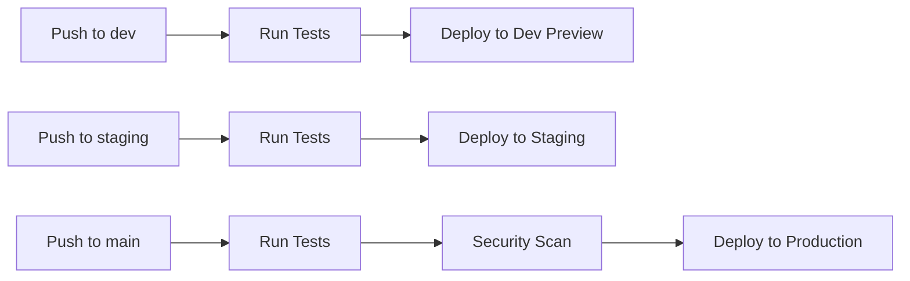

# MyBookshelf CI/CD Pipeline Setup Guide

## Overview

This guide covers the complete setup of the MyBookshelf automated CI/CD pipeline, including testing, deployment, and monitoring.

## 🚀 Pipeline Architecture

### **Components**

1. **Automated Testing** - Runs on every push/PR
2. **Security Scanning** - Vulnerability detection
3. **Automated Deployment** - Branch-based deployment strategy
4. **Health Monitoring** - 24/7 production monitoring
5. **Weekly Reporting** - Performance and health insights

### **Branch Strategy**

- `main` → Production deployment (mybookshelf.shop)
- `staging` → Staging deployment (auto-preview)
- `dev` → Development deployment (auto-preview)

## 📋 Prerequisites

### **Required Secrets**

Configure these in GitHub repository settings → Secrets and variables → Actions:

```bash
# Vercel Integration
VERCEL_TOKEN=your_vercel_token
VERCEL_ORG_ID=your_vercel_org_id
VERCEL_PROJECT_ID=your_vercel_project_id

# Optional: Slack Notifications
SLACK_WEBHOOK_URL=your_slack_webhook_url

# Optional: Supabase (for live database testing)
SUPABASE_URL=your_supabase_url
SUPABASE_SERVICE_ROLE_KEY=your_service_role_key
```

### **Vercel Setup**

1. Get Vercel token from https://vercel.com/account/tokens
2. Find Org ID in Vercel dashboard → Settings → General
3. Find Project ID in your project → Settings → General

## 🧪 Test Suite Integration

### **Automated Tests Run On:**

- Every push to `main`, `staging`, `dev`
- Every pull request
- Scheduled health checks (hourly)

### **Test Coverage:**

- **Affiliate Link Testing** - Revenue tracking validation
- **Database Integrity** - Data quality assurance
- **Deployment Testing** - Live site validation
- **Security Scanning** - Vulnerability detection

### **Test Results:**

- ✅ Auto-comments on PRs with test results
- 📊 JSON reports uploaded as artifacts
- 🚨 Auto-creates issues for failures

## 🚀 Deployment Workflow

### **Automatic Deployments:**



### **Deployment Gates:**

- All tests must pass
- Security scan must pass
- Manual approval for production (optional)

### **Post-Deployment:**

- Automatic health check validation
- Performance testing
- Affiliate link verification

## 📊 Monitoring & Alerting

### **Health Checks:**

- **Frequency:** Every hour
- **Scope:** Production site + affiliate links
- **Response:** Auto-creates GitHub issues on failure

### **Weekly Reports:**

- **Schedule:** Mondays at 9 AM
- **Content:** Performance trends, uptime, recommendations
- **Delivery:** GitHub artifacts + optional Slack

### **Alert Triggers:**

- Site unavailable (5xx errors)
- Slow response times (>3s)
- Broken affiliate links
- Failed deployments

## 🔧 Manual Operations

### **Trigger Manual Health Check:**

```bash
# Via GitHub Actions UI
# Go to Actions → Scheduled Health Check → Run workflow
```

### **Generate Weekly Report:**

```bash
cd backend/scripts
python generate_weekly_report.py --days 14  # Custom period
```

### **Test Specific Environment:**

```bash
# Test production
python test_deployment.py --url https://mybookshelf.shop --verbose

# Test staging
python test_deployment.py --url https://staging-url --performance
```

### **Run Complete Test Suite:**

```bash
cd backend/scripts
python run_all_tests.py --report --verbose
```

## 📈 Metrics & KPIs

### **Key Performance Indicators:**

- **Deployment Success Rate:** Target >95%
- **Average Response Time:** Target <1000ms
- **Affiliate Link Uptime:** Target 100%
- **Revenue Tracking Rate:** Target 100%

### **Business Metrics:**

- **Mean Time to Recovery (MTTR):** Target <1 hour
- **Deployment Frequency:** Multiple per day
- **Change Failure Rate:** Target <5%

## 🛠️ Troubleshooting

### **Common Issues:**

**Test Failures:**

```bash
# Check test output in GitHub Actions
# Download artifacts for detailed reports
# Review individual test failures
```

**Deployment Failures:**

```bash
# Check Vercel deployment logs
# Verify secrets are configured
# Ensure branch protection rules allow deployment
```

**Health Check Failures:**

```bash
# Check created GitHub issues
# Verify site availability manually
# Review Vercel function logs
```

### **Emergency Procedures:**

**Production Down:**

1. Check GitHub issues for auto-created alerts
2. Verify Vercel deployment status
3. Check DNS and SSL configuration
4. Test affiliate links manually
5. Consider rollback to previous deployment

**Broken Affiliate Links:**

1. Run affiliate link test manually
2. Check Amazon affiliate account status
3. Verify affiliate tag configuration
4. Test sample purchases

## 🔒 Security Considerations

### **Automated Security:**

- **Trivy** vulnerability scanning on all pushes
- **SARIF** reports uploaded to GitHub Security tab
- **Dependency** updates via automated PRs

### **Best Practices:**

- All secrets stored in GitHub encrypted secrets
- No sensitive data in code or logs
- Regular dependency updates
- Security alerts enabled

## 📚 Additional Resources

### **GitHub Actions Workflows:**

- `.github/workflows/ci.yml` - Main CI/CD pipeline
- `.github/workflows/scheduled-health-check.yml` - Monitoring

### **Test Scripts:**

- `backend/scripts/test_affiliate_links.py` - Affiliate link testing
- `backend/scripts/test_database_integrity.py` - Database validation
- `backend/scripts/test_deployment.py` - Live deployment testing
- `backend/scripts/run_all_tests.py` - Unified test runner

### **Monitoring Scripts:**

- `backend/scripts/generate_weekly_report.py` - Weekly health reports

## 🎯 Success Criteria

### **Pipeline is successful when:**

- ✅ All tests pass consistently
- ✅ Deployments are automated and reliable
- ✅ Health monitoring catches issues proactively
- ✅ Weekly reports show positive trends
- ✅ Business metrics meet targets

### **Business Impact:**

- **Revenue Protection:** Broken affiliate links detected immediately
- **User Experience:** Fast, reliable site performance
- **Development Velocity:** Safe, frequent deployments
- **Operational Excellence:** Proactive issue detection

---

_Updated: 2025-06-30 - Complete CI/CD pipeline implementation_
